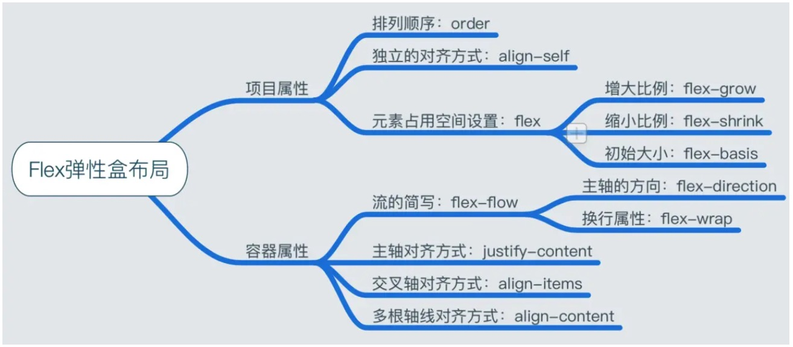

# 前言
最近接触的富文本编辑有这样的需求场景：
在可过滚动的编辑器中需要实现整体文本的垂直顶部/中部/底部对齐。简单来说需要实现多行文本在垂直方向上的布局。

# flex布局-弹性盒布局

在 flex 容器中默认存在两条轴，水平主轴(main axis) 和垂直的交叉轴(cross axis)，这是默认的设置。可以通过设置容器属性使垂直方向变为主轴，水平方向变为交叉轴。

在容器中的每个单元块被称之为 flex item，每个项目占据的主轴空间为 (main size), 占据的交叉轴的空间为 (cross size)。

## flex容器
```CSS
.container {
    display: flex | inline-flex;       //可以有两种取值
}
```

> 下面六种属性可以设置在容器上，它们分别是：
flex-direction
flex-wrap
flex-flow(前两者缩写)
justify-content
align-items
align-content

### flex-direction: 决定主轴的方向(即项目的排列方向)
flex-direction: row | row-reverse | column | column-reverse;
默认是row，主轴方向为水平方向，起点在左端。
column：主轴方向为垂直方向，起点在上沿

### flex-wrap: 决定容器内项目是否可换行
flex-wrap: nowrap | wrap | wrap-reverse;
默认是nowrap， 不换行
wrap：项目主轴总尺寸超出容器时换行，第一行在上方
wrap-reverse：换行，第一行在下方

### justify-content：定义了项目在主轴的对齐方式
justify-content: flex-start | flex-end | center | space-between | space-around;
默认是flex-start,左对齐
flex-end：右对齐
center：居中
space-between：两端对齐，项目之间的间隔相等，即剩余空间等分成间隙。
space-around：每个项目两侧的间隔相等，所以项目之间的间隔比项目与边缘的间隔大一倍。

### align-items: 定义了项目在交叉轴上的对齐方式
align-items: flex-start | flex-end | center | baseline | stretch;
默认值为 stretch 即如果项目未设置高度或者设为 auto，将占满整个容器的高度。
flex-start：交叉轴的起点对齐
flex-end：交叉轴的终点对齐
center：交叉轴的中点对齐
baseline: 项目的第一行文字的基线对齐

### align-content: 定义了多根轴线的对齐方式，如果项目只有一根轴线，那么该属性将不起作用
建立在主轴为水平方向时测试，即 flex-direction: row, flex-wrap: wrap
flex-start：水平轴线全部在交叉轴上的起点对齐
flex-end：轴线全部在交叉轴上的终点对齐
center：轴线全部在交叉轴上的中间对齐
space-between：轴线两端对齐，之间的间隔相等，即剩余空间等分成间隙。
space-around：每个轴线两侧的间隔相等，所以轴线之间的间隔比轴线与边缘的间隔大一倍。


## flex 项目
> 下面六种属性可以设置在项目上，它们分别是：
order
flex-basis
flex-grow
flex-shrink
align-self
### order：定义项目在容器中的排列顺序，越小越前面，默认值为 0

### align-self
auto | flex-start | flex-end | center | baseline | stretch
默认是auto，继承自flex容器的align-items属性值。控制单独某一个flex子项的垂直对齐方式

### flex-basis：<length> | auto;定义了在分配多余空间之前，项目占据的主轴空间，浏览器根据这个属性，计算主轴是否有多余空间

### flex-grow：<number> 默认值为 0，即如果存在剩余空间，也不放大
如果所有项目的 flex-grow 属性都为 1，则它们将等分剩余空间。(如果有的话)
如果一个项目的 flex-grow 属性为 2，其他项目都为 1，则前者占据的剩余空间将比其他项多一倍。
当然如果当所有项目以 flex-basis 的值排列完后发现空间不够了，且 flex-wrap：nowrap 时，此时 flex-grow 则不起作用了，这时候就需要接下来的这个属性。

### flex-shrink: <number> 默认值: 1，定义了项目的缩小比例
如果所有项目的 flex-shrink 属性都为 1，当空间不足时，都将等比例缩小。
如果一个项目的 flex-shrink 属性为 0，其他项目都为 1，则空间不足时，前者不缩小。

## 其他Flex知识点
- 当设置 flex 布局之后，子元素的 float、clear、vertical-align 的属性将会失效。
- Flexbox布局最适合应用程序的组件和小规模布局（一维布局）

在本次需求场景中，由于ql-container和ql-editor 的高度是相等的，所以需要先将ql-editor与ql-container的高度独立出来，且使得ql-editor的高度右p标签即文本内容填充
再
```Html
<div class="ql-container">
    <div class="ql-editor">
        <p></p>
        <p></p>
        <p></p>
        ...
    </div>
</div>
```
```CSS
.ql-container {
    display: flex;
    flex-direction: column;
    justify-content: flex-end
}
```

参考链接
https://zhuanlan.zhihu.com/p/25303493
https://www.zhangxinxu.com/wordpress/2018/10/display-flex-css3-css/